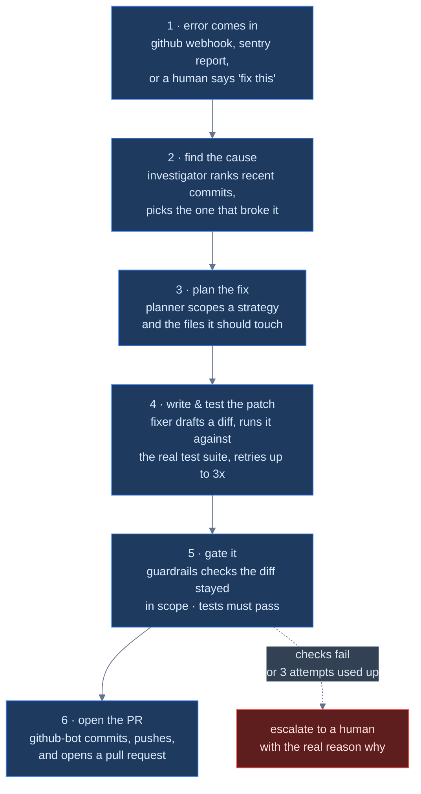
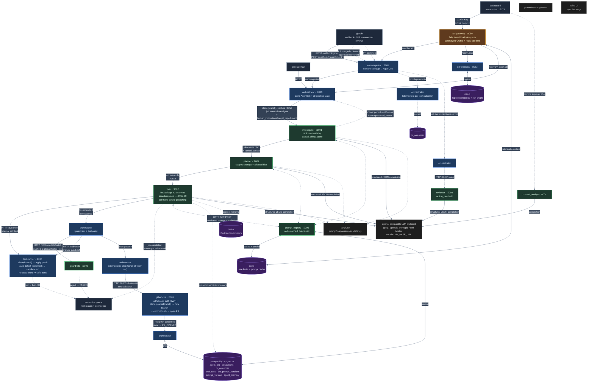

# gitoracle

gitoracle is an event-driven, multi-agent autonomous coding system. point it at a bug — a github webhook, a plain-english description, or a sentry-style error report — and it investigates the root cause across your git history, plans a scoped fix, writes a patch, runs it against your real test suite, and opens a pull request. every step is a durable kafka event, every unsafe or low-confidence outcome is escalated to a human review queue instead of silently failing, and every job's outcome (root cause, prompt version, token spend, PR result) is measured and shown on a live dashboard rather than asserted.

## project overview

most "AI fix my bug" tools are a single LLM call wrapped in a nice UI: it sees an error message, guesses a patch, and hopes. gitoracle is built around the belief that autonomous code changes need the same rigor as a human PR review pipeline — root-cause analysis grounded in real git history, a scoped plan before any code is touched, guardrails that block unauthorized file changes, real test execution (not a simulated pass), and a human-in-the-loop escalation path for anything the system isn't confident about.

the system is deliberately decoupled: 6 java spring boot microservices and 7 python fastapi agents communicate almost entirely through kafka topics, plus a handful of synchronous HTTP calls where a hard dependency makes sense (guardrails validation, test execution, PR creation). no service holds the whole pipeline in memory — a job's state lives in postgres, and any service can be killed and restarted without losing the job's place in the pipeline.

## key features

- **two ways to trigger a fix, by design, not by accident.** the dashboard's "ask to fix" form has an "investigate root cause first" toggle: on (default) runs the full investigator → planner → fixer chain (~4,500 tokens, ~25s, real root-cause attribution); off skips straight to the fixer with a synthesized plan (~900 tokens, ~8s) for when a human already knows exactly what to change. both are real, supported paths, not a fallback.
- **root-cause investigation grounded in real git history**, not vibes. the investigator agent ranks actual commits by a causal-effect score against the reported bug, and that ranking — not just `git rev-parse HEAD` — becomes the job's recorded root cause.
- **branch-aware end to end.** every job can target a specific branch — clone, test, and PR base all follow it — not just whatever `git clone` happens to check out by default.
- **strict security guardrails.** a dedicated guardrails service validates every LLM-generated patch's touched files against the plan's authorized file list before anything is applied — an empty allow-list means deny-all, not allow-all.
- **real test execution, not a rubber stamp.** the test runner clones the repo, applies the patch, and runs the actual detected test framework (maven/gradle/pytest/npm) in a sandboxed workspace. a repo with no test suite is a safe-pass (nothing to verify), not a hard failure.
- **escalation queue, not a black box.** any job guardrails rejects, tests fail, or an agent can't complete is routed to a human-review queue with the real failure reason attached — never silently dropped or retried forever.
- **measured, not asserted, dashboard metrics.** prompt-version accuracy, token spend, PR merge/close/revert rates, and eval-harness accuracy are all computed from real job outcomes stored in postgres — there is no hardcoded or simulated number left anywhere in the UI.
- **commit explorer** with a `commit_analyst` agent you can ask questions about any commit, and a one-click "apply fix as PR" when it spots a regression.
- **dynamic prompt registry** with version history — every job records which exact prompt version each agent ran on, so per-version accuracy is a real join, not a guess.
- **full observability**: langfuse traces every LLM call (prompt, response, tokens, latency); prometheus/grafana track service health; kafka UI shows topic backlogs.

## tech stack

### java backend (core orchestration) — 6 spring boot 3.2 / java 21 microservices
- **api-gateway** (`:8080`) — single entry point for the dashboard; enforces `X-API-Key` auth (fail-closed) and CORS centrally, then routes to the right backend service.
- **orchestrator** (`:8083`) — the pipeline's brain. owns `AgentJob` state in postgres, consumes/produces every kafka event, and makes the synchronous calls to guardrails, test runner, and github-bot that gate each stage.
- **error-ingestor** (`:8081`) — receives github webhooks (`pull_request`, `pull_request_review`, `workflow_run`, PR comments) and sentry-style error reports, deduplicates via semantic similarity, and kicks off a job.
- **git-forensics** (`:8082`) — serves the risk heatmap's neo4j-backed developer/file risk queries.
- **test-runner** (`:8084`) — clones a repo (optionally at a specific branch), applies a patch, auto-detects and runs the real test framework in a sandbox.
- **github-bot** (`:8085`) — authenticates as a github app, clones, branches, commits, pushes, and opens the actual pull request.
- **git-oracle-core** — shared library: JPA entities, kafka topic constants, event DTOs. every cross-service contract lives here so services can't silently drift out of sync.

### python AI core — 7 fastapi agents, all kafka-driven
- **investigator** (`:9001`) — ranks git commits by likely causal effect on the reported bug.
- **planner** (`:9007`) — turns an investigation into a scoped, constrained fix plan (strategy, affected files/functions, max lines to change).
- **fixer** (`:9002`) — runs a ReAct loop (up to 3 attempts) generating a search/replace edit, computes a guaranteed-valid unified diff via `difflib`, and self-tests before publishing.
- **guardrails** (`:9006`) — validates a patch only touches files the plan authorized.
- **reviewer** (`:9003`) — evaluates human PR comments and decides whether they warrant a new fix cycle.
- **commit_analyst** (`:9004`) — answers natural-language questions about a specific commit for the commit explorer.
- **prompt_registry** (`:9005`) — serves versioned system prompts from postgres, redis-cached, with hot-reload on activation.

### infrastructure & storage
- **apache kafka (KRaft mode)** — the event bus every java service and python agent communicates through.
- **postgreSQL + pgvector** — job state, escalations, PR outcomes, eval runs, prompt versions, episodic/semantic agent memory.
- **neo4j** — repository dependency/risk graph for the risk heatmap.
- **qdrant** — vector search over codebase snippets for RAG context.
- **redis** — API gateway rate limiting, prompt-registry caching.
- **langfuse, prometheus, grafana, kafka UI** — observability stack.
- **docker compose** — all of the above, one command, memory-capped to run comfortably on an 8GB machine.

## architecture at a glance

the same pipeline, stripped to the 6 stages that matter: an error comes in, gitoracle figures out which commit caused it, plans a fix, writes and tests a patch, then opens a PR. everything else in the detailed diagram below is what happens *inside* these boxes.



there's also a shortcut: a human who already knows the fix can skip straight to step 4 (see "two entry points" below) — cheaper and faster, but with no root-cause investigation behind it.

## detailed architecture

a top-to-bottom walk of the full pipeline — every service, every kafka topic (named directly on the arrow that carries it), every synchronous HTTP call, and every storage/observability dependency.



**two entry points into the pipeline, both real:**

1. **`error-ingested` → investigator → planner → fixer** (the "full pipeline"). triggered by a github webhook, a sentry-style report, or the dashboard's "ask to fix" with the investigate toggle on. `handleErrorIngested` clones the repo (at a specific branch if requested), captures HEAD, and dispatches to the investigator — whose top-ranked cause becomes the job's recorded root commit, not just `git rev-parse HEAD`.
2. **`job.events.fix` directly** (the "direct-fix" shortcut). triggered by "ask to fix" with the toggle off. skips investigation entirely with a synthesized plan — ~5x cheaper and faster, correct when a human already knows the fix, but with no root-cause data and no file context beyond what's parsed out of the instruction text.

every override a job can carry — `human_instructions`, `target_repo`, `branch` — is threaded through every kafka hop end-to-end rather than looked up from the database, since these are per-request overrides, not part of a job's durable identity.

## project structure

- `java-backend/`: all 6 java microservices, each its own gradle subproject, plus the shared `git-oracle-core` library (JPA entities, kafka topic constants, event DTOs — the single source of truth for cross-service contracts).
- `ai_core/`: the 7 python fastapi agents (`agents/`), shared LLM/kafka/memory/prompt-registry helpers (`shared/`), and the regression test suite (`tests/`).
- `dashboard/`: the react + typescript + vite web UI.
- `cli/`: the `gitOracle` terminal client.
- `eval/`: the evaluation harness (`run_evals.py`) and golden dataset generator (`setup_test_repo.py`) — builds a throwaway local repo with two seeded bugs and measures the pipeline's real root-cause and patch accuracy against it.
- `infrastructure/`: prometheus/grafana config.
- `docker-compose.infra.yml`: the backing infrastructure stack (kafka, postgres, neo4j, qdrant, redis, langfuse, prometheus, grafana, kafka UI) — memory-capped per container.
- `docker-compose.services.yml`: containerized alternative to running the java services as local processes via `start_local.sh`.
- `start_local.sh` / `stop_local.sh`: bring up/tear down every java service and python agent as local processes. `stop_local.sh` exists specifically because a naive `lsof -ti :<port> | xargs kill` also matches `com.docker.backend` (prometheus holds a live connection to every scraped port) and will crash docker desktop — it filters strictly by command name instead.
- `llm-server/`: *(deprecated)* previously held local `llama.cpp` config; inference is now routed to any openai-compatible endpoint via `LLM_BASE_URL`.

## deployment & setup

### prerequisites
- java 21 (JDK)
- python 3.11+
- node.js 18+
- docker & docker compose
- an openai-compatible LLM API key (groq, openai, anthropic, or self-hosted) — set `LLM_BASE_URL`, `LLM_MODEL_NAME`, and `OPENAI_API_KEY` in `.env`.
- 8GB RAM minimum. the full stack (9 infra containers + 6 java services + 7 python agents + dashboard) is memory-capped to fit: `java-backend/gradle.properties` caps build/daemon memory and disables the gradle daemon, `start_local.sh` caps each service's JVM heap, and `docker-compose.infra.yml` sets a `mem_limit` on every container. there's little headroom left for other heavy apps running at the same time. 16GB+ gives comfortable margin instead of a tight fit.

### getting started

1. **clone the repository** and navigate into the root directory.

2. **configure environment**
   ```bash
   cp .env.example .env
   ```
   fill in `LLM_BASE_URL` / `LLM_MODEL_NAME` / `OPENAI_API_KEY` for your chosen inference provider, `GITORACLE_API_KEY` (the dashboard's login key), and github app credentials if you want real PR creation.

3. **launch infrastructure**
   ```bash
   docker compose -f docker-compose.infra.yml up -d
   ```

4. **initialize backend & AI core**
   ```bash
   ./start_local.sh
   ```
   this builds every java service's jar (~10 minutes the first time) and starts all 6 java services, all 7 python agents, and the dashboard as local processes. alternatively, run the java services as containers instead:
   ```bash
   docker compose -f docker-compose.services.yml up -d --build
   ```
   to stop everything safely (without risking docker desktop — see the note on `stop_local.sh` above):
   ```bash
   ./stop_local.sh
   ```

5. **interact with gitoracle**
   open the dashboard (`http://localhost:5173`) and log in with `GITORACLE_API_KEY`. from there:
   - **ask to fix** — describe a bug in plain english, optionally pick a branch, choose whether to run full investigation or the fast direct path, and watch it turn into a PR.
   - **commit explorer** — browse commit history, inspect diffs, chat with `commit_analyst` about any commit.
   - **escalation queue** — review jobs the pipeline couldn't resolve confidently, with the real failure reason attached.
   - **eval dashboard** — real accuracy/token/PR-outcome metrics computed from actual job history.
   - or use the `gitOracle` CLI for terminal-based workflows.

## system interaction flow

a concrete walkthrough of the full-pipeline path, e.g. fixing a bug reported via a github actions workflow failure:

1. **ingestion.** error-ingestor receives the `workflow_run` webhook, builds an internal payload (`repo`, `error_id`, `stacktrace`), and calls `SemanticDedupService.ingest()`, which persists an `AgentJob` and publishes `error-ingested`.
2. **clone + dispatch.** the orchestrator's `handleErrorIngested` reuses that job (never creates a duplicate row), clones the repo — at a specific branch if the job requested one — captures the real HEAD SHA, and publishes `job.events.investigate` carrying the raw error payload, any human instructions, and the target branch.
3. **investigation.** the investigator agent analyzes recent git history for the affected area, ranks candidate commits by `causal_effect_score`, and publishes `job.events.plan`. the orchestrator snoops this handoff to persist the investigation result **and** promote the top-ranked cause to the job's `rootCommit` — the actual measured root cause, not just HEAD.
4. **planning.** the planner agent turns the investigation into a scoped `PlannerOutput` (strategy, affected files/functions, max lines to change, confidence) and publishes `job.events.fix`.
5. **fixing.** the fixer agent runs a ReAct loop (up to 3 attempts): generates a search/replace edit via the LLM, computes a guaranteed-syntactically-valid unified diff via python's `difflib` (never an LLM-authored diff, which was unreliable), self-tests against test runner, and on success publishes `fix-generated`. on exhausting all attempts, it publishes `job-escalated` with the real failure reason and the planner's own confidence score.
6. **guardrails.** the orchestrator calls guardrails synchronously to confirm the patch only touches files the plan actually authorized.
7. **official test verification.** the orchestrator calls test runner independently (in addition to the fixer's own internal self-test) — clones the target branch fresh, applies the patch, auto-detects and runs the real test framework. a repo with no test suite at all is a safe-pass, not a failure.
8. **PR creation.** on tests passing, the orchestrator calls github-bot, which authenticates as a github app, clones the source branch, cuts a new `gitoracle-fix-<jobId>` branch from it, commits, pushes, and opens a PR with that branch as the base — not always the repo's default branch. the orchestrator only marks the job `PR_OPENED` (with the real `prUrl`) once github-bot actually confirms success; this call is idempotent against kafka's at-least-once redelivery, so a duplicate `tests-passed` event can never downgrade an already-successful job back to `ESCALATED`.
9. **outcome tracking.** when that PR is later merged, closed, approved, or reverted, error-ingestor's webhook handler publishes to `github-pr-events`, which the orchestrator persists as a `pr_outcome` row — this is what backs the dashboard's real (not hardcoded) PR merge-rate metric.

## core API endpoints

routed through the api-gateway (`:8080`) unless noted as service-internal.

- `POST /webhook/github` — github app webhook receiver (issues, PRs, PR reviews, workflow failures, PR comments).
- `POST /webhook/{tenantId}/sentry` — sentry-style error report ingestion.
- `POST /api/v1/trigger` — "ask to fix": `{ repoUrl, issueDescription, targetRepo?, branch?, investigateFirst? }`. returns `mode: "full-pipeline"` or `"direct-fix"` depending on `investigateFirst`.
- `POST /api/v1/jobs/{jobId}/feedback` — "regenerate fix" with new human instructions, reusing the job's existing workspace.
- `GET /api/v1/jobs` / `GET /api/v1/jobs/{id}` — list/poll job status.
- `GET /api/v1/commits` / `GET /api/v1/commits/{sha}/diff` — commit explorer data.
- `GET /api/v1/escalations` — jobs pending human review, with real failure reasons and confidence scores.
- `GET /api/v1/risk` — neo4j-backed developer/file risk data (routed to git-forensics, not the orchestrator).
- `GET /api/v1/pr-outcomes/stats` — real merge/close/approve/revert counts and rate, `null` (not a fabricated number) when nothing's been recorded yet.
- `GET /api/v1/prompts/stats` — measured per-prompt-version accuracy and average token spend, joined from actual job outcomes.
- `GET /api/v1/evals` / `POST /api/v1/evals` — eval harness run history.
- **service-internal** (not gateway-routed): `POST :9006/validate/patch` (guardrails), `POST :8084/test` (test runner), `POST :8085/pull-request` (github-bot), `GET :9005/prompts/{agent}/{key}` and `.../active` (prompt content, and content+version), `PUT :9005/prompts/{agent}/{key}/activate/{version}`.

## frontend dashboard

react + typescript + vite. pages:

- **job feed** — every job, live state, token usage.
- **ask to fix** — trigger a job: repo, branch, instructions, target PR repo, and the investigate-first toggle with an inline explanation of the cost/speed tradeoff.
- **my repos** — client-side registered repo shortcuts (localStorage), pre-fills other pages.
- **commit explorer** — browse commits, expand diffs, chat with `commit_analyst`, one-click "apply fix as PR".
- **escalation queue** — jobs pending human review with real failure reasons.
- **risk heatmap** — neo4j-backed developer/file risk visualization.
- **eval dashboard** — accuracy trend, per-prompt-version performance, PR outcome breakdown — all computed from real data, with explicit "no data yet" states rather than placeholder numbers.
- **langfuse traces** — link-out to the full LLM observability UI.
- **simulator** — hand-craft and fire a github webhook payload at the real ingestion endpoint for testing.
- **admin settings** — dark/light mode (persists across sessions), token budget config.

## CLI reference

the `gitOracle` CLI (`cli/gitOracle/main.py`) provides terminal-based control:

- `gitoracle analyze --repo <url> --commit <hash>` — triggers a deep architectural analysis job for a specific commit.
- `gitoracle fix --repo <url> --commit <hash> --error <msg> --file <path> --line <num>` — manually triggers the fixer agent for a specific error.
- `gitoracle watch --job <uuid>` — streams a running job's progress to the terminal.
- `gitoracle status` — health check table of all microservices, databases, and the LLM endpoint.
- `gitoracle eval --golden-dir <dir> [--report <file>]` — runs the evaluation harness against golden test cases.
- `gitoracle prompts list --agent <name>` — lists all prompt versions (active and inactive) for an agent.
- `gitoracle prompts activate --agent <name> --version <version>` — hot-swaps the active prompt for an agent.

## development guidelines

- **event-driven first.** prefer asynchronous kafka events over synchronous REST calls between services. the few exceptions (guardrails validation, test runner, github-bot) are deliberate: the orchestrator needs to block on their result before deciding the job's next state.
- **shared core module.** any new JPA entity, kafka topic constant, or event DTO goes in `git-oracle-core` — never duplicate a contract across services.
- **idempotency is not optional.** kafka delivers at-least-once. any handler that mutates job state or calls an external system (PR creation, outcome recording) must tolerate being invoked twice for the same event without corrupting state or double-acting — see `handleTestsPassed`'s prUrl guard and `handlePrOutcome`'s `existsByJobIdAndOutcome` check for the pattern.
- **never fabricate a success state or a dashboard metric.** if something can't be measured yet, show "no data" — a plausible-looking number that isn't real is worse than an honest gap.
- **regression tests for anything that failed silently once.** `ai_core/tests/` and `java-backend/orchestrator/src/test/` exist specifically to pin bugs that were confirmed live and could easily reintroduce themselves (e.g. an idempotency guard, a column width, a duplicated CORS header) — a test that can't be shown to actually fail without the fix isn't worth adding.
- **commit history.** atomic commits with the actual root cause and how it was confirmed in the message — not just what changed.
