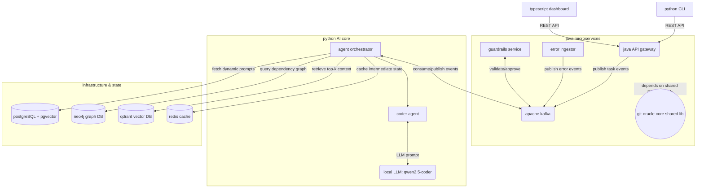

# gitoracle

gitoracle is an enterprise-grade, event-driven autonomous AI coding assistant designed to solve complex coding tasks, debug issues, and architect solutions entirely locally and securely. by leveraging a decoupled multi-agent architecture with a java-based backend, a python AI core, and a local LLM server, gitoracle ensures that your proprietary code, git histories, and infrastructure data never leave your secure environment.

## project overview

in modern software development, integrating AI capabilities directly into the IDE and workflow can drastically increase productivity. however, most powerful AI tools rely on third-party cloud APIs (like OpenAI or Anthropic), which introduces significant security and privacy risks when handling proprietary enterprise codebases. gitoracle solves this by providing a local, self-hosted multi-agent system that mimics the capabilities of advanced cloud-based agents while running entirely on your infrastructure.

by utilizing a configurable OpenAI-compatible LLM API (e.g. OpenAI, Anthropic, or an external self-hosted model) and offloading massive contextual datasets to a highly optimized vector and graph database stack, gitoracle maintains a tight, highly relevant context window, enabling lightning-fast and accurate AI completions, refactors, and architectural suggestions.

## key features

- **Configurable LLM API:** seamlessly connect to any OpenAI-compatible endpoint. Local `llama.cpp` server has been deprecated to improve inference performance and flexibility.
- **event-driven microservices architecture:** unlike traditional monolithic AI wrappers, gitoracle uses a decoupled architecture where all inter-service communication flows through kafka topics, ensuring high speed, fault tolerance, and resilience.
- **advanced context management (RAG):** offloads massive datasets—such as multi-year git histories, large error stacks, and full repository structures—to qdrant (vector DB) and pgvector. it retrieves only the top-k most relevant snippets to strictly adhere to the model's 8192 token context limit.
- **dynamic prompt registry:** avoids brittle hardcoded python strings. all agent instructions, personas, and task prompts are dynamically fetched from a postgreSQL prompt registry, allowing for easy updates and A/B testing of AI behaviors.
- **strict security guardrails:** features a dedicated java guardrails service that mandates validation of all LLM-generated outputs before any code is executed in the user's environment or pushed to remote repositories.
- **multi-modal interaction:** interfaces with the user through a robust typescript dashboard and a versatile python CLI.

## tech stack

### java backend (core orchestration)
- **java 21 & spring boot 3.2.x:** modern, high-performance foundation for enterprise microservices.
- **gradle 8.7:** handles multi-module subproject builds (e.g., API gateway, error ingestor, guardrails).
- **git-oracle-core:** a shared library module housing standard JPA models, kafka topic constants, and event DTOs to enforce DRY principles across the backend.

### python AI core (agentic logic)
- **python 3.11+ & fastapi:** handles asynchronous agent coordination and high-speed API endpoints.
- **pydantic:** enforces strict data validation for all LLM inputs and outputs.
- **external API:** configurable via `.env` to route inference to standard API endpoints.

### infrastructure & storage
- **apache kafka:** the central event bus connecting java services and python agents.
- **postgreSQL (with pgvector):** stores structured relational data and the dynamic prompt registry.
- **neo4j:** maintains a graph representation of the repository's architecture and dependency tree for complex reasoning tasks.
- **qdrant:** purpose-built vector database for ultra-fast semantic search over codebase snippets and documentation.
- **redis:** provides high-speed caching for frequent queries and agent state management.
- **docker compose:** orchestrates the entire backing infrastructure for zero-headache local deployments.

## detailed architecture



## project structure

- `java-backend/`: contains all java microservices (API gateway, error ingestor, guardrails service) and the critical `git-oracle-core` shared module.
- `python-ai/` & `ai_core/`: houses the python-based AI orchestrators, specific agent implementations, and RAG pipelines.
- `dashboard/`: the modern web-based UI for interacting with the AI assistant.
- `cli/`: the command-line interface `gitOracle/main.py` for terminal-based workflows.
- `infrastructure/`: docker compose manifests (`docker-compose.yml`, `docker-compose.infra.yml`) for spinning up kafka, databases, and caches.
- `llm-server/`: *(deprecated)* previously contained configuration and scripts for local `llama.cpp`.

## deployment & setup

### prerequisites
ensure your host machine meets the following requirements:
- java 21 (JDK)
- python 3.11+
- node.js 18+
- docker & docker compose
- at least 16GB RAM (32GB recommended for optimal local LLM performance)

### getting started

1. **clone the repository**
   clone this repository to your local machine and navigate into the root directory.

2. **configure environment**
   duplicate the `.env.example` file to `.env` and adjust the variables to match your local setup.
   ```bash
   cp .env.example .env
   ```

3. **launch infrastructure**
   start up the required backing services (kafka, postgreSQL, neo4j, qdrant, redis) using docker compose.
   ```bash
   docker compose -f docker-compose.infra.yml up -d
   ```

4. **initialize backend & AI core**
   execute the setup script to boot up the java microservices, the python AI core, and the local LLM server.
   ```bash
   ./start_local.sh
   ```

5. **interact with gitoracle**
   open the dashboard in your browser or utilize the `gitOracle` CLI tool to begin analyzing and modifying your codebase securely.

## system interaction flow & github bot

gitoracle relies on a highly decoupled event-driven architecture. here is how the primary components interact during a standard workflow, such as fixing an issue reported on github:

1. **github bot webhook:** when a user comments on a pull request or opens an issue, the gitoracle github bot receives the event or a workflow run failure triggers the webhook.
2. **api gateway / orchestrator ingestion:** the bot forwards the payload to the java API gateway or directly to the orchestrator (`/webhook/github`).
3. **event publishing:** the orchestrator creates an `agent_job` in PostgreSQL and publishes a `job.events.plan` task event to the kafka bus.
4. **ai planner consumption:** the python AI core (planner agent) consumes this event, generates a multi-step execution plan using the LLM, and publishes `job.events.fix`.
5. **context retrieval (rag) & fixing:** the fixer agent retrieves relevant code snippets and previous error traces from Qdrant/pgvector episodic memory to build a comprehensive context window, and applies a codebase patch.
6. **test runner verification:** the orchestrator calls the java Test Runner natively to execute containerized tests (e.g. Pytest, Gradle) on the AI-generated patch to verify success before merging.
7. **github bot pr creation:** once tests pass, the orchestrator triggers the GitHub Bot to create a pull request with the autonomous fix and a detailed markdown summary of the agent's work.

## core API endpoints

the java API gateway and orchestrator expose several crucial REST endpoints for external clients:

- `POST /webhook/github`: entry point for all github bot interactions (issues, PRs, workflow failures).
- `POST /test`: internal Test Runner endpoint for executing containerized verification suites.
- `POST /pull-request`: internal GitHub Bot endpoint for opening autonomous PRs.
- `GET /api/v1/jobs/{id}`: poll the status of a specific background job.
- `GET /api/v1/prompts/{agent}`: fetch the active system prompt for a specific agent from the postgreSQL registry.
- `POST /api/v1/prompts/{agent}/activate`: switch the active prompt version for A/B testing or rollbacks.

## frontend dashboard

the frontend dashboard (built with typescript, react, and vite) serves as the visual command center for the gitoracle platform. its primary roles include:

- **real-time job tracking:** monitor the progress of AI agents as they work on tasks, providing visual traces of their thoughts, context retrievals, and LLM inferences.
- **prompt management:** a visual interface for the prompt registry to edit, version, and activate system prompts for various agents without touching python code or SQL.
- **system health monitoring:** view live latency, kafka topic backlogs, and the status of the local LLM server.
- **human-in-the-loop review:** when the guardrails service flags a potentially unsafe code change, the dashboard provides a diff view for developers to manually approve or reject the AI's proposal.

## CLI reference

the `gitOracle` CLI tool (`cli/gitOracle/main.py`) provides power users with terminal-based control over the AI agents.

- `gitoracle analyze --repo <url> --commit <hash>`: triggers a deep architectural analysis job for a specific commit.
- `gitoracle fix --repo <url> --commit <hash> --error <msg> --file <path> --line <num>`: manually triggers the fixer agent to resolve a specific error at a given line of code.
- `gitoracle watch --job <uuid>`: attaches to a running job and streams its progress and status directly to the terminal.
- `gitoracle status`: displays a health check table of all microservices, databases, and the LLM server.
- `gitoracle eval --golden-dir <dir> [--report <file>]`: runs the evaluation harness against a directory of golden test cases to benchmark agent accuracy and latency.
- `gitoracle prompts list --agent <name>`: lists all prompt versions (active and inactive) for a specific agent.
- `gitoracle prompts activate --agent <name> --version <version>`: hot-swaps the active prompt for a given agent.

## development guidelines

- **event-driven first:** prefer asynchronous kafka events over synchronous REST calls for inter-service communication to maintain system resilience.
- **shared core module:** any new JPA entity, kafka topic constant, or event DTO must be placed in the `git-oracle-core` java module to prevent code duplication and ensure strict contract adherence between microservices.
- **commit history:** ensure all commits are atomic, well-described, and follow the established logical grouping convention (e.g., `feat(core): implement semantic search DTO`).
