# GitOracle

GitOracle is an event-driven, multi-agent autonomous coding system. Point it at a bug — a GitHub webhook, a plain-English description, or a Sentry-style error report — and it investigates the root cause across your git history, plans a scoped fix, writes a patch, runs it against your real test suite, and opens a pull request. Every step is a durable Kafka event, every unsafe or low-confidence outcome is escalated to a human review queue instead of silently failing, and every job's outcome (root cause, prompt version, token spend, PR result) is measured and shown on a live dashboard rather than asserted.

## Project overview

Most "AI fix my bug" tools are a single LLM call wrapped in a nice UI: it sees an error message, guesses a patch, and hopes. GitOracle is built around the belief that autonomous code changes need the same rigor as a human PR review pipeline — root-cause analysis grounded in real git history, a scoped plan before any code is touched, guardrails that block unauthorized file changes, real test execution (not a simulated pass), and a human-in-the-loop escalation path for anything the system isn't confident about.

The system is deliberately decoupled: 6 Java Spring Boot microservices and 7 Python FastAPI agents communicate exclusively through Kafka topics (plus a handful of synchronous HTTP calls where a hard dependency makes sense, like Guardrails validation). No service holds the whole pipeline in memory — a job's state lives in Postgres, and any service can be killed and restarted without losing the job's place in the pipeline.

## Key features

- **Two ways to trigger a fix, by design, not by accident.** The dashboard's "Ask to Fix" form has an "Investigate root cause first" toggle: on (default) runs the full Investigator → Planner → Fixer chain (~4,500 tokens, ~25s, real root-cause attribution); off skips straight to the Fixer with a synthesized plan (~900 tokens, ~8s) for when a human already knows exactly what to change. Both are real, supported paths, not a fallback.
- **Root-cause investigation grounded in real git history**, not vibes. The Investigator agent ranks actual commits by a causal-effect score against the reported bug, and that ranking — not just `git rev-parse HEAD` — becomes the job's recorded root cause.
- **Branch-aware end to end.** Every job can target a specific branch — clone, test, and PR base all follow it — not just whatever `git clone` happens to check out by default.
- **Strict security guardrails.** A dedicated Guardrails service validates every LLM-generated patch's touched files against the plan's authorized file list before anything is applied — an empty allow-list means deny-all, not allow-all.
- **Real test execution, not a rubber stamp.** The Test Runner clones the repo, applies the patch, and runs the actual detected test framework (Maven/Gradle/pytest/npm) in a sandboxed workspace. A repo with no test suite is a safe-pass (nothing to verify), not a hard failure.
- **Escalation queue, not a black box.** Any job Guardrails rejects, tests fail, or an agent can't complete is routed to a human-review queue with the real failure reason attached — never silently dropped or retried forever.
- **Measured, not asserted, dashboard metrics.** Prompt-version accuracy, token spend, PR merge/close/revert rates, and eval-harness accuracy are all computed from real job outcomes stored in Postgres — there is no hardcoded or simulated number left anywhere in the UI.
- **Commit Explorer** with a `commit_analyst` agent you can ask questions about any commit, and a one-click "Apply Fix as PR" when it spots a regression.
- **Dynamic prompt registry** with version history — every job records which exact prompt version each agent ran on, so per-version accuracy is a real join, not a guess.
- **Full observability**: Langfuse traces every LLM call (prompt, response, tokens, latency); Prometheus/Grafana track service health; Kafka UI shows topic backlogs.

## Tech stack

### Java backend (core orchestration) — 6 Spring Boot 3.2 / Java 21 microservices
- **api-gateway** (`:8080`) — single entry point for the dashboard; enforces `X-API-Key` auth (fail-closed) and CORS centrally, then routes to the right backend service.
- **orchestrator** (`:8083`) — the pipeline's brain. Owns `AgentJob` state in Postgres, consumes/produces every Kafka event, and makes the synchronous calls to Guardrails, Test Runner, and github-bot that gate each stage.
- **error-ingestor** (`:8081`) — receives GitHub webhooks (`pull_request`, `pull_request_review`, `workflow_run`, PR comments) and Sentry-style error reports, deduplicates via semantic similarity, and kicks off a job.
- **git-forensics** (`:8082`) — serves the Risk Heatmap's Neo4j-backed developer/file risk queries.
- **test-runner** (`:8084`) — clones a repo (optionally at a specific branch), applies a patch, auto-detects and runs the real test framework in a sandbox.
- **github-bot** (`:8085`) — authenticates as a GitHub App, clones, branches, commits, pushes, and opens the actual pull request.
- **git-oracle-core** — shared library: JPA entities, Kafka topic constants, event DTOs. Every cross-service contract lives here so services can't silently drift out of sync.

### Python AI core — 7 FastAPI agents, all Kafka-driven
- **investigator** (`:9001`) — ranks git commits by likely causal effect on the reported bug.
- **planner** (`:9007`) — turns an investigation into a scoped, constrained fix plan (strategy, affected files/functions, max lines to change).
- **fixer** (`:9002`) — runs a ReAct loop (up to 3 attempts) generating a search/replace edit, computes a guaranteed-valid unified diff via `difflib`, and self-tests before publishing.
- **guardrails** (`:9006`) — validates a patch only touches files the plan authorized.
- **reviewer** (`:9003`) — evaluates human PR comments and decides whether they warrant a new fix cycle.
- **commit_analyst** (`:9004`) — answers natural-language questions about a specific commit for the Commit Explorer.
- **prompt_registry** (`:9005`) — serves versioned system prompts from Postgres, Redis-cached, with hot-reload on activation.

### Infrastructure & storage
- **Apache Kafka (KRaft mode)** — the event bus every Java service and Python agent communicates through.
- **PostgreSQL + pgvector** — job state, escalations, PR outcomes, eval runs, prompt versions, episodic/semantic agent memory.
- **Neo4j** — repository dependency/risk graph for the Risk Heatmap.
- **Qdrant** — vector search over codebase snippets for RAG context.
- **Redis** — API gateway rate limiting, prompt-registry caching.
- **Langfuse, Prometheus, Grafana, Kafka UI** — observability stack.
- **Docker Compose** — all of the above, one command, memory-capped to run comfortably on an 8GB machine.

## Detailed architecture

```mermaid
%%{init: {'theme':'base', 'themeVariables': {'primaryColor':'#1e293b','primaryTextColor':'#e2e8f0','primaryBorderColor':'#475569','lineColor':'#64748b','secondaryColor':'#334155','tertiaryColor':'#0f172a','fontSize':'13px'}}}%%
flowchart TB
    subgraph CLIENTS["🖥️ Clients"]
        direction LR
        DASH["TypeScript Dashboard<br/>(React + Vite, :5173)"]
        CLI["Python CLI<br/>gitOracle/main.py"]
        GH["GitHub<br/>webhooks / PR comments"]
    end

    DASH -->|"X-API-Key<br/>REST /api/v1/*"| GW
    CLI -->|REST| ORCH
    GH -->|"POST /webhook/github<br/>POST /webhook/{tenant}/sentry"| EI

    subgraph GATEWAY["🚪 API Gateway :8080"]
        GW["TenantContextFilter<br/>(fail-closed X-API-Key auth)<br/>+ centralized CORS<br/>+ Redis rate limiting"]
    end

    GW -->|"/webhook/**"| EI
    GW -->|"/api/v1/risk"| GF
    GW -->|"/api/v1/** (catch-all)"| ORCH

    subgraph JAVA["☕ Java Microservices"]
        EI["error-ingestor :8081<br/>─────────────<br/>• semantic dedup → AgentJob<br/>• pull_request / pull_request_review<br/>  → github-pr-events<br/>• workflow_run failure → ERROR_INGESTED"]
        GF["git-forensics :8082<br/>─────────────<br/>Neo4j risk queries"]
        ORCH["orchestrator :8083<br/>═════════════════════<br/>owns AgentJob + all pipeline state<br/>consumes/produces every Kafka topic<br/>calls Guardrails, Test Runner, github-bot"]
        TR["test-runner :8084<br/>─────────────<br/>clone(branch) → apply patch<br/>→ auto-detect framework<br/>→ run in sandbox<br/>no-tests ⇒ safe-pass"]
        GB["github-bot :8085<br/>─────────────<br/>GitHub App auth (JWT)<br/>clone(sourceBranch) → new branch<br/>→ commit/push → open PR"]
    end

    subgraph PYTHON["🐍 Python Agents (FastAPI, all Kafka-driven)"]
        INV["investigator :9001<br/>ranks commits by<br/>causal_effect_score"]
        PLN["planner :9007<br/>scopes strategy +<br/>affected files/functions"]
        FIX["fixer :9002<br/>ReAct loop (≤3 attempts)<br/>search/replace → difflib diff<br/>self-tests before publish"]
        GRD["guardrails :9006<br/>touched files ⊆<br/>plan.affected_files<br/>(empty allow-list = deny-all)"]
        REV["reviewer :9003<br/>evaluates human PR<br/>comments for action_needed"]
        CA["commit_analyst :9004<br/>Q&A over a single commit<br/>(Commit Explorer)"]
        PR_REG["prompt_registry :9005<br/>versioned prompts,<br/>Redis-cached, hot-reload"]
    end

    subgraph KAFKA["📨 Apache Kafka (KRaft) — every arrow below is a topic"]
        direction TB
        T1["error-ingested"]
        T2["job.events.investigate"]
        T3["job.events.plan"]
        T4["job.events.fix"]
        T5["fix-generated"]
        T6["tests-passed"]
        T7["job-escalated"]
        T8["github-pr-events"]
        T9["job.events.review.received"]
    end

    EI -->|produce| T1
    ORCH -->|"clone(branch), capture HEAD<br/>consume"| T1
    ORCH -->|"produce (+ human_instructions,<br/>target_repo, branch)"| T2
    INV -->|consume| T2
    INV -->|"produce (+ ranked_causes)"| T3
    PLN -->|consume| T3
    PLN -->|"produce (+ plan)"| T4
    FIX -->|consume| T4
    FIX -->|"produce on success"| T5
    FIX -.->|"produce on failure<br/>(3 attempts exhausted)"| T7
    ORCH -->|consume, persist rootCommit<br/>from top ranked_cause| T3
    ORCH -->|"consume → call Guardrails<br/>→ call Test Runner"| T5
    ORCH -->|produce on tests pass| T6
    ORCH -.->|produce on test/guardrails fail| T7
    ORCH -->|"consume → call github-bot<br/>(idempotent: skip if prUrl set)"| T6
    GB -->|"PR opened → job.prUrl,<br/>state=PR_OPENED"| ORCH
    EI -->|"PR merged/closed/<br/>approved/reverted"| T8
    ORCH -->|"consume → pr_outcomes<br/>(idempotent per job+outcome)"| T8
    EI -->|"PR comment"| T9
    ORCH -->|consume| T9
    ORCH -->|"HTTP :9003/review"| REV

    FIX <-->|"HTTP GET/POST<br/>versioned system prompt<br/>+ report attribution"| PR_REG
    PLN <-->|HTTP| PR_REG
    INV <-->|HTTP| PR_REG
    ORCH -->|"HTTP POST<br/>:9006/validate/patch"| GRD
    ORCH -->|"HTTP POST :8084/test<br/>(branch, patchDiff)"| TR
    FIX -->|"HTTP POST :8084/test<br/>(internal self-test)"| TR
    ORCH -->|"HTTP POST :8085/pull-request<br/>(sourceBranch)"| GB
    DASH -->|"Commit Explorer<br/>chat"| CA

    subgraph STORAGE["💾 Storage & Infra"]
        direction LR
        PG[("PostgreSQL + pgvector<br/>─────────<br/>agent_job · escalations<br/>pr_outcomes · eval_runs<br/>job_prompt_versions<br/>prompt_version · agent_memory")]
        NEO[("Neo4j<br/>repo dependency<br/>+ risk graph")]
        QD[("Qdrant<br/>vector search<br/>RAG context")]
        RD[("Redis<br/>rate limiting +<br/>prompt cache")]
    end

    ORCH <-->|JPA| PG
    GF <-->|Cypher| NEO
    FIX -.->|episodic/semantic memory| PG
    FIX -.->|context retrieval| QD
    GW <-->|rate limit counters| RD
    PR_REG <-->|cache + persist| RD
    PR_REG <-->|persist| PG

    subgraph OBS["📊 Observability"]
        direction LR
        LF["Langfuse<br/>every LLM call:<br/>prompt/response/tokens/latency"]
        PROM["Prometheus<br/>+ Grafana"]
        KUI["Kafka UI<br/>topic backlogs"]
    end
    INV -.-> LF
    PLN -.-> LF
    FIX -.-> LF

    subgraph LLM["🧠 External Inference"]
        GROQ["OpenAI-compatible endpoint<br/>(Groq / OpenAI / Anthropic / self-hosted)<br/>configured via LLM_BASE_URL"]
    end
    INV -->|structured JSON completion| GROQ
    PLN -->|structured JSON completion| GROQ
    FIX -->|structured JSON completion| GROQ
    REV -->|structured JSON completion| GROQ
    CA -->|completion| GROQ

    classDef javaSvc fill:#1e3a5f,stroke:#3b82f6,color:#dbeafe
    classDef pySvc fill:#1e3a2f,stroke:#22c55e,color:#dcfce7
    classDef storage fill:#3a1e5f,stroke:#a78bfa,color:#ede9fe
    classDef gateway fill:#5f3a1e,stroke:#f59e0b,color:#fef3c7
    classDef client fill:#1e293b,stroke:#94a3b8,color:#e2e8f0
    class EI,GF,ORCH,TR,GB javaSvc
    class INV,PLN,FIX,GRD,REV,CA,PR_REG pySvc
    class PG,NEO,QD,RD storage
    class GW gateway
    class DASH,CLI,GH client
```



**Two entry points into the pipeline, both real:**

1. **`error-ingested` → Investigator → Planner → Fixer** (the "full pipeline"). Triggered by a GitHub webhook, a Sentry-style report, or the dashboard's "Ask to Fix" with the investigate toggle on. `handleErrorIngested` clones the repo (at a specific branch if requested), captures HEAD, and dispatches to the Investigator — whose top-ranked cause becomes the job's recorded root commit, not just `git rev-parse HEAD`.
2. **`job.events.fix` directly** (the "direct-fix" shortcut). Triggered by "Ask to Fix" with the toggle off. Skips investigation entirely with a synthesized plan — ~5x cheaper and faster, correct when a human already knows the fix, but with no root-cause data and no file context beyond what's parsed out of the instruction text.

Every override a job can carry — `human_instructions`, `target_repo`, `branch` — is threaded through every Kafka hop end-to-end rather than looked up from the database, since these are per-request overrides, not part of a job's durable identity.

## Project structure

- `java-backend/`: all 6 Java microservices, each its own Gradle subproject, plus the shared `git-oracle-core` library (JPA entities, Kafka topic constants, event DTOs — the single source of truth for cross-service contracts).
- `ai_core/`: the 7 Python FastAPI agents (`agents/`), shared LLM/Kafka/memory/prompt-registry helpers (`shared/`), and the regression test suite (`tests/`).
- `dashboard/`: the React + TypeScript + Vite web UI.
- `cli/`: the `gitOracle` terminal client.
- `eval/`: the evaluation harness (`run_evals.py`) and golden dataset generator (`setup_test_repo.py`) — builds a throwaway local repo with two seeded bugs and measures the pipeline's real root-cause and patch accuracy against it.
- `infrastructure/`: Prometheus/Grafana config.
- `docker-compose.infra.yml`: the backing infrastructure stack (Kafka, Postgres, Neo4j, Qdrant, Redis, Langfuse, Prometheus, Grafana, Kafka UI) — memory-capped per container.
- `docker-compose.services.yml`: containerized alternative to running the Java services as local processes via `start_local.sh`.
- `start_local.sh` / `stop_local.sh`: bring up/tear down every Java service and Python agent as local processes. `stop_local.sh` exists specifically because a naive `lsof -ti :<port> | xargs kill` also matches `com.docker.backend` (Prometheus holds a live connection to every scraped port) and will crash Docker Desktop — it filters strictly by command name instead.
- `llm-server/`: *(deprecated)* previously held local `llama.cpp` config; inference is now routed to any OpenAI-compatible endpoint via `LLM_BASE_URL`.

## Deployment & setup

### Prerequisites
- Java 21 (JDK)
- Python 3.11+
- Node.js 18+
- Docker & Docker Compose
- An OpenAI-compatible LLM API key (Groq, OpenAI, Anthropic, or self-hosted) — set `LLM_BASE_URL`, `LLM_MODEL_NAME`, and `OPENAI_API_KEY` in `.env`.
- 8GB RAM minimum. The full stack (9 infra containers + 6 Java services + 7 Python agents + dashboard) is memory-capped to fit: `java-backend/gradle.properties` caps build/daemon memory and disables the Gradle daemon, `start_local.sh` caps each service's JVM heap, and `docker-compose.infra.yml` sets a `mem_limit` on every container. There's little headroom left for other heavy apps running at the same time. 16GB+ gives comfortable margin instead of a tight fit.

### Getting started

1. **Clone the repository** and navigate into the root directory.

2. **Configure environment**
   ```bash
   cp .env.example .env
   ```
   Fill in `LLM_BASE_URL` / `LLM_MODEL_NAME` / `OPENAI_API_KEY` for your chosen inference provider, `GITORACLE_API_KEY` (the dashboard's login key), and GitHub App credentials if you want real PR creation.

3. **Launch infrastructure**
   ```bash
   docker compose -f docker-compose.infra.yml up -d
   ```

4. **Initialize backend & AI core**
   ```bash
   ./start_local.sh
   ```
   This builds every Java service's jar (~10 minutes the first time) and starts all 6 Java services, all 7 Python agents, and the dashboard as local processes. Alternatively, run the Java services as containers instead:
   ```bash
   docker compose -f docker-compose.services.yml up -d --build
   ```
   To stop everything safely (without risking Docker Desktop — see the note on `stop_local.sh` above):
   ```bash
   ./stop_local.sh
   ```

5. **Interact with GitOracle**
   Open the dashboard (`http://localhost:5173`) and log in with `GITORACLE_API_KEY`. From there:
   - **Ask to Fix** — describe a bug in plain English, optionally pick a branch, choose whether to run full investigation or the fast direct path, and watch it turn into a PR.
   - **Commit Explorer** — browse commit history, inspect diffs, chat with `commit_analyst` about any commit.
   - **Escalation Queue** — review jobs the pipeline couldn't resolve confidently, with the real failure reason attached.
   - **Eval Dashboard** — real accuracy/token/PR-outcome metrics computed from actual job history.
   - or use the `gitOracle` CLI for terminal-based workflows.

## System interaction flow

A concrete walkthrough of the full-pipeline path, e.g. fixing a bug reported via GitHub Actions workflow failure:

1. **Ingestion.** error-ingestor receives the `workflow_run` webhook, builds an internal payload (`repo`, `error_id`, `stacktrace`), and calls `SemanticDedupService.ingest()`, which persists an `AgentJob` and publishes `error-ingested`.
2. **Clone + dispatch.** The orchestrator's `handleErrorIngested` reuses that job (never creates a duplicate row), clones the repo — at a specific branch if the job requested one — captures the real HEAD SHA, and publishes `job.events.investigate` carrying the raw error payload, any human instructions, and the target branch.
3. **Investigation.** The investigator agent analyzes recent git history for the affected area, ranks candidate commits by `causal_effect_score`, and publishes `job.events.plan`. The orchestrator snoops this handoff to persist the investigation result **and** promote the top-ranked cause to the job's `rootCommit` — the actual measured root cause, not just HEAD.
4. **Planning.** The planner agent turns the investigation into a scoped `PlannerOutput` (strategy, affected files/functions, max lines to change, confidence) and publishes `job.events.fix`.
5. **Fixing.** The fixer agent runs a ReAct loop (up to 3 attempts): generates a search/replace edit via the LLM, computes a guaranteed-syntactically-valid unified diff via Python's `difflib` (never an LLM-authored diff, which was unreliable), self-tests against Test Runner, and on success publishes `fix-generated`. On exhausting all attempts, it publishes `job-escalated` with the real failure reason and the planner's own confidence score.
6. **Guardrails.** The orchestrator calls Guardrails synchronously to confirm the patch only touches files the plan actually authorized.
7. **Official test verification.** The orchestrator calls Test Runner independently (in addition to the fixer's own internal self-test) — clones the target branch fresh, applies the patch, auto-detects and runs the real test framework. A repo with no test suite at all is a safe-pass, not a failure.
8. **PR creation.** On tests passing, the orchestrator calls github-bot, which authenticates as a GitHub App, clones the source branch, cuts a new `gitoracle-fix-<jobId>` branch from it, commits, pushes, and opens a PR with that branch as the base — not always the repo's default branch. The orchestrator only marks the job `PR_OPENED` (with the real `prUrl`) once github-bot actually confirms success; this call is idempotent against Kafka's at-least-once redelivery, so a duplicate `tests-passed` event can never downgrade an already-successful job back to `ESCALATED`.
9. **Outcome tracking.** When that PR is later merged, closed, approved, or reverted, error-ingestor's webhook handler publishes to `github-pr-events`, which the orchestrator persists as a `pr_outcome` row — this is what backs the dashboard's real (not hardcoded) PR merge-rate metric.

## Core API endpoints

Routed through the API Gateway (`:8080`) unless noted as service-internal.

- `POST /webhook/github` — GitHub App webhook receiver (issues, PRs, PR reviews, workflow failures, PR comments).
- `POST /webhook/{tenantId}/sentry` — Sentry-style error report ingestion.
- `POST /api/v1/trigger` — "Ask to Fix": `{ repoUrl, issueDescription, targetRepo?, branch?, investigateFirst? }`. Returns `mode: "full-pipeline"` or `"direct-fix"` depending on `investigateFirst`.
- `POST /api/v1/jobs/{jobId}/feedback` — "Regenerate Fix" with new human instructions, reusing the job's existing workspace.
- `GET /api/v1/jobs` / `GET /api/v1/jobs/{id}` — list/poll job status.
- `GET /api/v1/commits` / `GET /api/v1/commits/{sha}/diff` — Commit Explorer data.
- `GET /api/v1/escalations` — jobs pending human review, with real failure reasons and confidence scores.
- `GET /api/v1/risk` — Neo4j-backed developer/file risk data (routed to git-forensics, not the orchestrator).
- `GET /api/v1/pr-outcomes/stats` — real merge/close/approve/revert counts and rate, `null` (not a fabricated number) when nothing's been recorded yet.
- `GET /api/v1/prompts/stats` — measured per-prompt-version accuracy and average token spend, joined from actual job outcomes.
- `GET /api/v1/evals` / `POST /api/v1/evals` — eval harness run history.
- **Service-internal** (not gateway-routed): `POST :9006/validate/patch` (Guardrails), `POST :8084/test` (Test Runner), `POST :8085/pull-request` (github-bot), `GET :9005/prompts/{agent}/{key}` and `.../active` (prompt content, and content+version), `PUT :9005/prompts/{agent}/{key}/activate/{version}`.

## Frontend dashboard

React + TypeScript + Vite. Pages:

- **Job Feed** — every job, live state, token usage.
- **Ask to Fix** — trigger a job: repo, branch, instructions, target PR repo, and the investigate-first toggle with an inline explanation of the cost/speed tradeoff.
- **My Repos** — client-side registered repo shortcuts (localStorage), pre-fills other pages.
- **Commit Explorer** — browse commits, expand diffs, chat with `commit_analyst`, one-click "Apply Fix as PR".
- **Escalation Queue** — jobs pending human review with real failure reasons.
- **Risk Heatmap** — Neo4j-backed developer/file risk visualization.
- **Eval Dashboard** — accuracy trend, per-prompt-version performance, PR outcome breakdown — all computed from real data, with explicit "no data yet" states rather than placeholder numbers.
- **Langfuse Traces** — link-out to the full LLM observability UI.
- **Simulator** — hand-craft and fire a GitHub webhook payload at the real ingestion endpoint for testing.
- **Admin Settings** — dark/light mode (persists across sessions), token budget config.

## CLI reference

The `gitOracle` CLI (`cli/gitOracle/main.py`) provides terminal-based control:

- `gitoracle analyze --repo <url> --commit <hash>` — triggers a deep architectural analysis job for a specific commit.
- `gitoracle fix --repo <url> --commit <hash> --error <msg> --file <path> --line <num>` — manually triggers the fixer agent for a specific error.
- `gitoracle watch --job <uuid>` — streams a running job's progress to the terminal.
- `gitoracle status` — health check table of all microservices, databases, and the LLM endpoint.
- `gitoracle eval --golden-dir <dir> [--report <file>]` — runs the evaluation harness against golden test cases.
- `gitoracle prompts list --agent <name>` — lists all prompt versions (active and inactive) for an agent.
- `gitoracle prompts activate --agent <name> --version <version>` — hot-swaps the active prompt for an agent.

## Development guidelines

- **Event-driven first.** Prefer asynchronous Kafka events over synchronous REST calls between services. The few exceptions (Guardrails validation, Test Runner, github-bot) are deliberate: the orchestrator needs to block on their result before deciding the job's next state.
- **Shared core module.** Any new JPA entity, Kafka topic constant, or event DTO goes in `git-oracle-core` — never duplicate a contract across services.
- **Idempotency is not optional.** Kafka delivers at-least-once. Any handler that mutates job state or calls an external system (PR creation, outcome recording) must tolerate being invoked twice for the same event without corrupting state or double-acting — see `handleTestsPassed`'s prUrl guard and `handlePrOutcome`'s `existsByJobIdAndOutcome` check for the pattern.
- **Never fabricate a success state or a dashboard metric.** If something can't be measured yet, show "no data" — a plausible-looking number that isn't real is worse than an honest gap.
- **Regression tests for anything that failed silently once.** `ai_core/tests/` and `java-backend/orchestrator/src/test/` exist specifically to pin bugs that were confirmed live and could easily reintroduce themselves (e.g. an idempotency guard, a column width, a duplicated CORS header) — a test that can't be shown to actually fail without the fix isn't worth adding.
- **Commit history.** Atomic commits with the actual root cause and how it was confirmed in the message — not just what changed.
